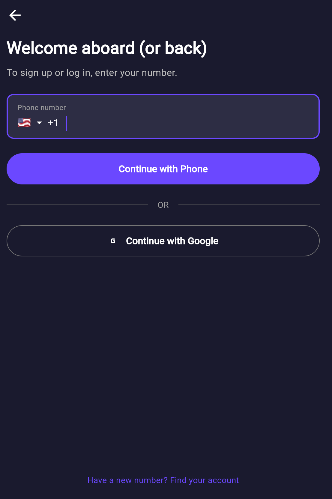
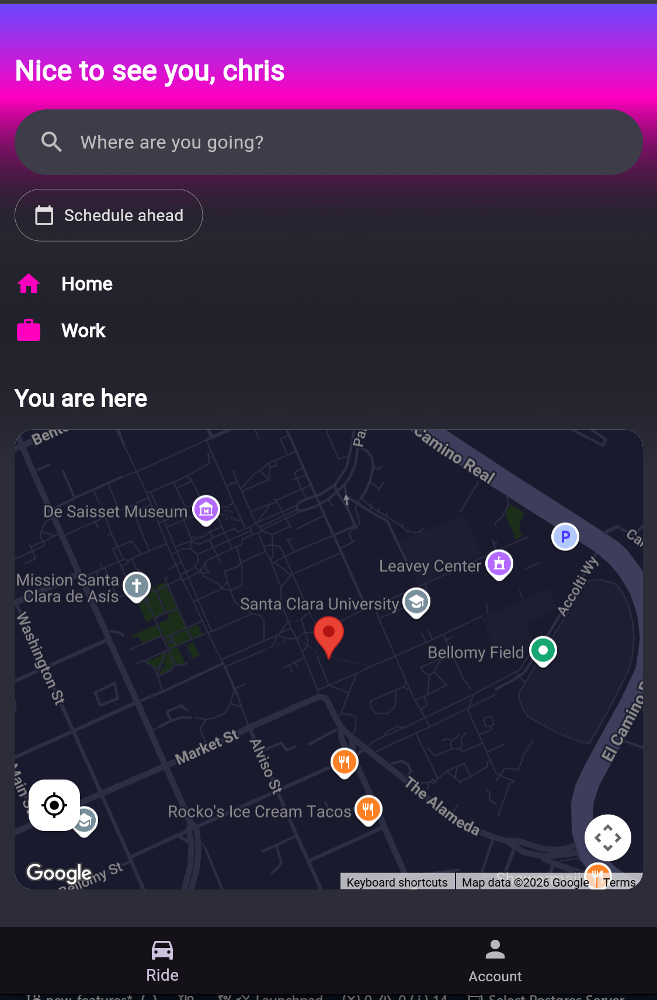
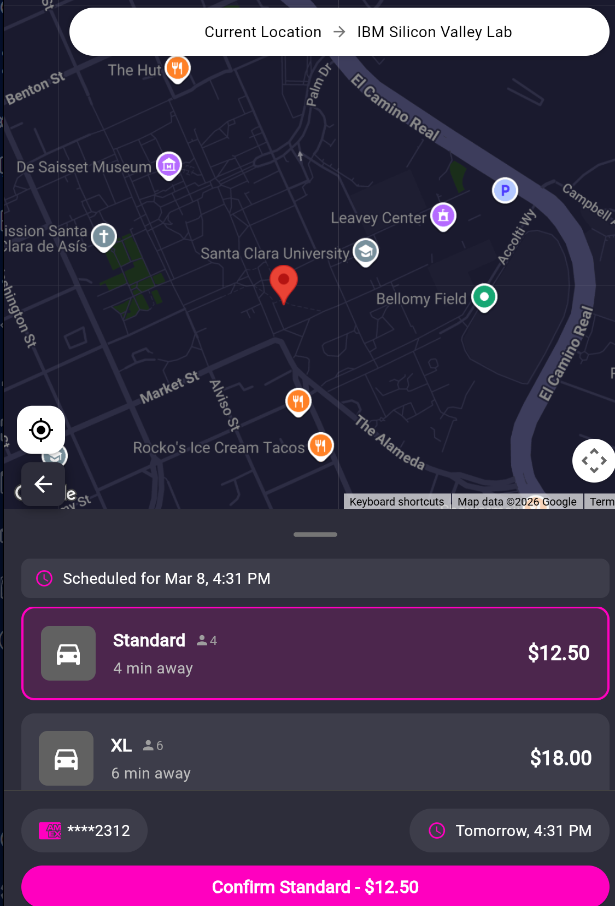
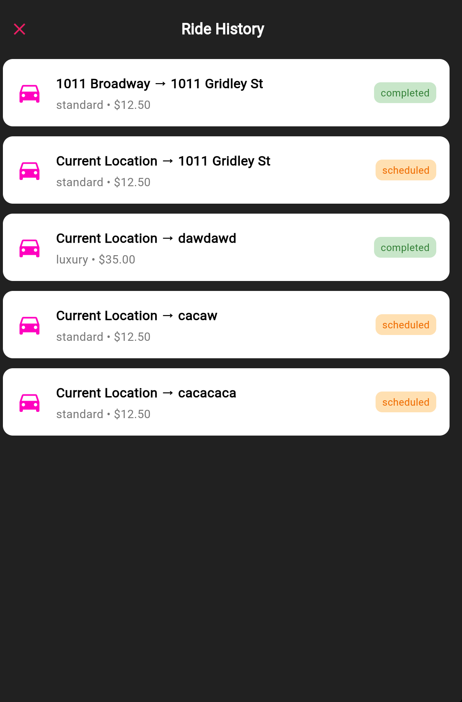
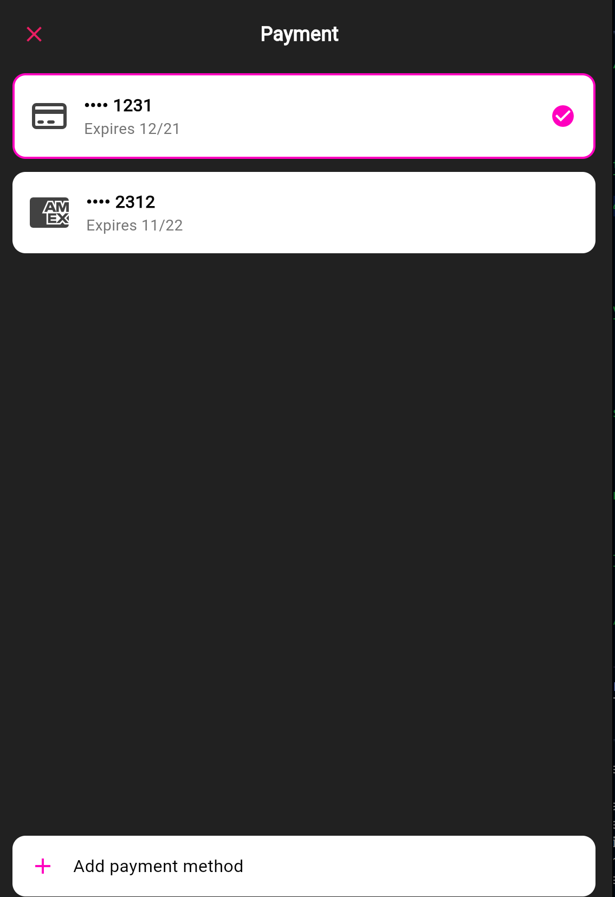

# re_lyft


A Lyft-style ride-sharing app built with Flutter.

## Screenshots

<p align="center">
  
  
  
</p>

<p align="center">
  
  
  
</p>

## Features

- **Phone & Google Authentication** - Firebase Auth with SMS verification
- **Real-time Maps** - Google Maps with dark theme and custom markers
- **Places Autocomplete** - Address search with location bias and debouncing
- **Ride Booking** - Select ride types (Standard, XL, Comfort, Luxury)
- **Scheduling** - Book rides in advance
- **Payment Management** - Add/remove cards, set default payment method
- **Ride History** - View past and scheduled rides

## Tech Stack

- **Frontend:** Flutter / Dart
- **Backend:** Firebase (Auth, Firestore)
- **APIs:** Google Maps, Places, Directions
- **State Management:** Provider
- **CI/CD:** GitHub Actions

## Getting Started

### Prerequisites

- Flutter 3.41.4+
- Firebase project
- Google Maps API key

### Setup

1. Clone the repo
   ```bash
   git clone https://github.com/Cermias2004/re_lyft.git
   cd re_lyft
   ```

2. Install dependencies
   ```bash
   flutter pub get
   ```

3. Configure Firebase
   ```bash
   flutterfire configure
   ```

4. Add your Google Maps API key to:
   - `android/app/src/main/AndroidManifest.xml`
   - `lib/services/places_services.dart`

5. Run the app
   ```bash
   flutter run
   ```

## Project Structure

```
lib/
├── core/
│   └── theme/
├── features/
│   ├── account/
│   ├── home/
│   ├── login/
│   ├── payments/
│   ├── rides/
│   └── settings/
├── services/
│   ├── location_services.dart
│   └── places_services.dart
├── shared/
│   └── widgets/
└── main.dart
```

## License

MIT
